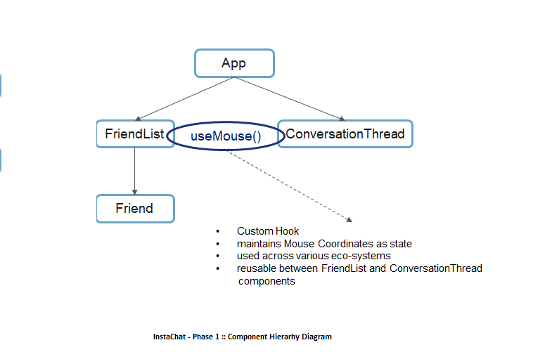

# InstaChat

## Introduction

InstaChat is a chat software that allows user to instantly add, connect and chat with his / her friends. The app displays the list of friends and the conversation messages of the friend selected from the friend list. 

For each friend in the friend list, the user can view friends’ online/offline status. This status is also indicated when the user selects the friend to view the friend’s conversation messages.

The app publishes notifications each time a friend sends message. However, to avoid disturbance, the user can turn on mute options for the selected friend and can also then turn it off to continue receiving the notifications.

As a Front-end developer, you need to design InstaChat app using React. The app should be created in different phases where each phase comprises of certain functionalities.

## User Stories

Following are the user stories to be developed in the phase1:
-	As a user, I should be able to view friend list.
-	As a user, I should be able to view the friend status for each friend in the friend list.
-	As a user, I should be able to view the status of the selected friend while viewing the conversation messages. 
-	As a user, I should be able to mute a friend to stop receiving notifications for the messages sent.
-	As a user, I should be able to turn off mute for the friend to continue receiving the notifications.

## Challenges

The solution for InstaChat exists. However, the developers detected the following challenges in the existing solution: 
- Solution was developed using Class Components due to which: 
    - Stateful logic was hard to reuse. 
    - Class code became complex and hard to understand. 
    - The developers found the code confusing due to the need to bind components and event handlers using 'this'. 
    

## Problem Statement

The phase 1 solution for InstaChat exists. 
Solution was developed using Function Components that used Custom Hooks for developing reusable stateful logic. 

One such Custom Hook code is written to develop stateful logic that manages the friend’s status which is used by the component that displays friend list and the component that displays conversation messages.

Developers now want to develop test cases for implementing automated testing.
Automated testing is fast, economical, accurate and helps in early identification of defects. 

However, since the developers have used Custom Hooks, they are facing challenges in writing test cases using only Jest due to
Rule of Hooks that does not allow Hooks to be invoked outside Function Component.

## Proposed Solution

The developer team has decided to overcome the challenge by using React Hooks Testing Library for testing Custom Hooks.

This library provides API to build a test component that invokes Hooks and allows test code to run the Hooks code.

## Test Cases 

You can write the test cases to test the following requirements:  

1. UseFriendStatus  
  1. Should be able to fetch the friends online/offline status  
  2. Should be able to fetch the friends online/offline status when the props change. This should also result in a state change.  

2. UseFriendNotificationSettings  
  1. Should be able to fetch notification settings assigned for a friend  
  2. Should be able to fetch notification settings assigned for a friend when the props change. This should also result in a state change.   
  3. Should be able to trigger the Update Notification settings when the setter of the custom hook is called. This should also result in a state change.   

## Instructions 

1. Download and unzip the boilerplate code.    
2. Run the command `npm install` to install the dependencies.    
3. Open the boilerplate code in VSCode to develop the assignment solution.    
4. The boilerplate consists of the solution code for InstaChat app.  
5. The boilerplate also contains the `people.json` file located within the server folder.  
6. Run the command `json-server --port 3001 --id _id server/people.json` to run the json-server to access people's data.  
7. Test cases are to be added under the folder `test` inside the src folder  
8. Custom Hooks should be implemented using react-hooks-testing-library.  
9. First, test the solution locally by running the command npm run test.  
10. Refactor the solution to ensure all test cases are passing.
11. The evaluation of this practice assignment will be done based on the coverage data collected while the test cases run.

    ***Coverage results indicate what amount of solution code under test is executed while the test code runs.***

12. Following is the threshold criteria, required to be met to pass this challenge.
- branches: 50
- functions: 75
- lines: 75
- statements: 75
13. DO NOT MODIFY THE PROVIDED SOLUTION CODE, ELSE THIS MAY IMPACT THE COVERAGE RESULTS AND SET THE STATUS "FAILED" FOR THIS ASSIGNMENT.  
14. Zip the solution code with the name same as the assignment name.  
15. Upload the zipped solution for submission. 